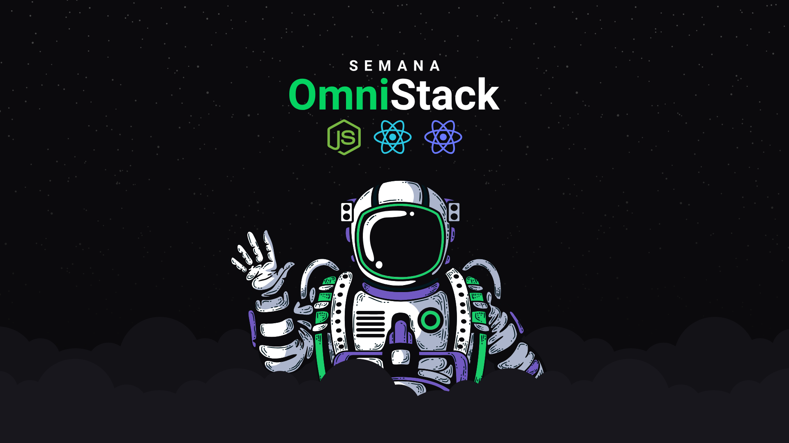

</img>
<h1 align="center">Semana Omnistack 10</h1>
<p align="center">Projeto <strong>DevRadar</strong> desenvolvido durante a Semana Omnistack da Rocketseat</p>

<p align="center">
  <a aria-label="Versão do Node" href="https://github.com/nodejs/node/blob/master/doc/changelogs/CHANGELOG_V13.md#13.6.0">
    </img>
  </a>
  <a aria-label="Versão do React" href="https://github.com/facebook/react/blob/master/CHANGELOG.md#16120-november-14-2019">
    </img>
  </a>
</p>

## Instalação

Para se conectar ao banco de dados MongoDB, no diretório-raiz do projeto, renomeie o arquivo `.env.example` para `.env`, passando o seu nome de usuário e a sua senha.

Para instalar as dependências e executar o servidor (modo desenvolvimento), clone o projeto em seu computador e em seguida execute:

```bash
cd backend
yarn install
yarn dev
```

Para iniciar o frontend utilize o comando:

```bash
cd web
yarn install
yarn start
```
